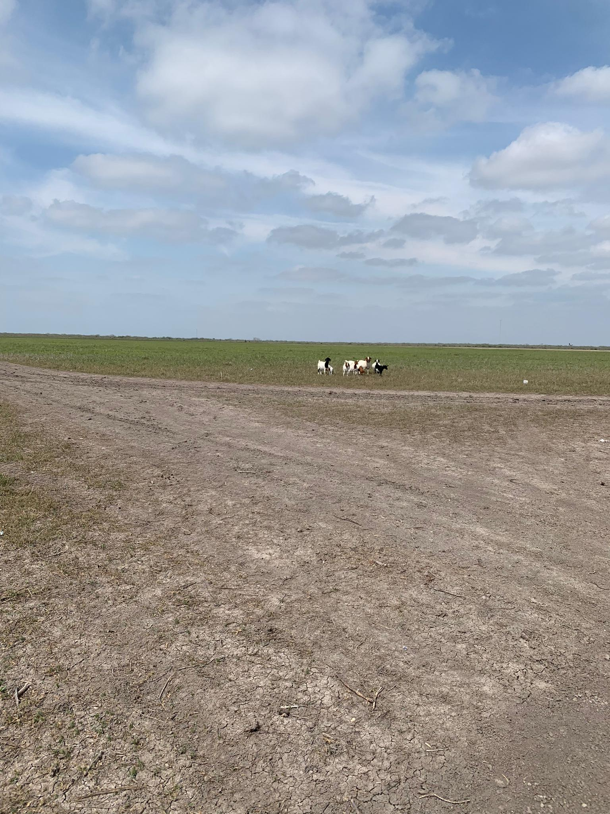
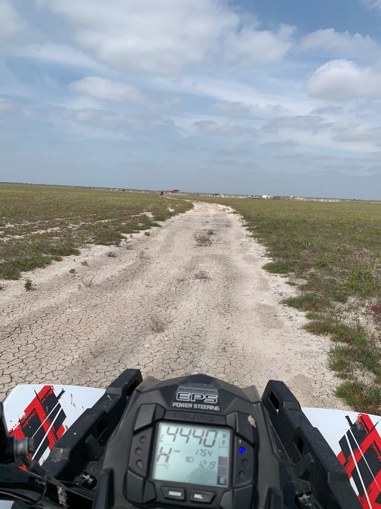
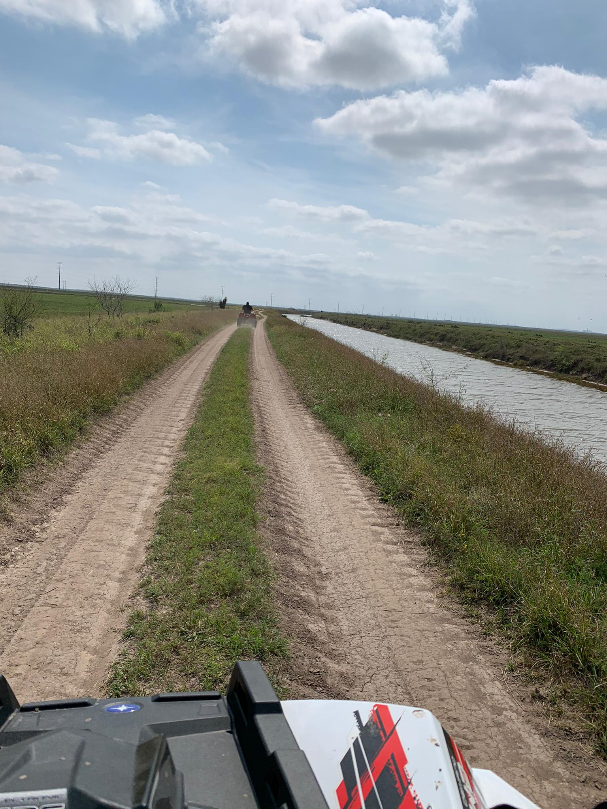
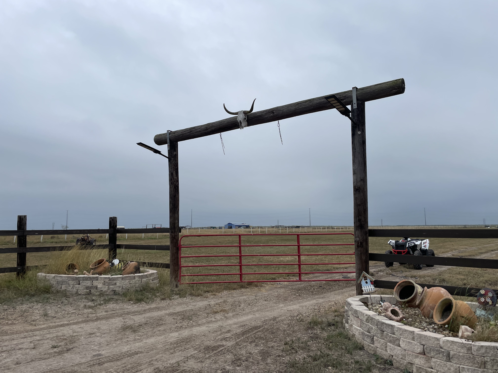
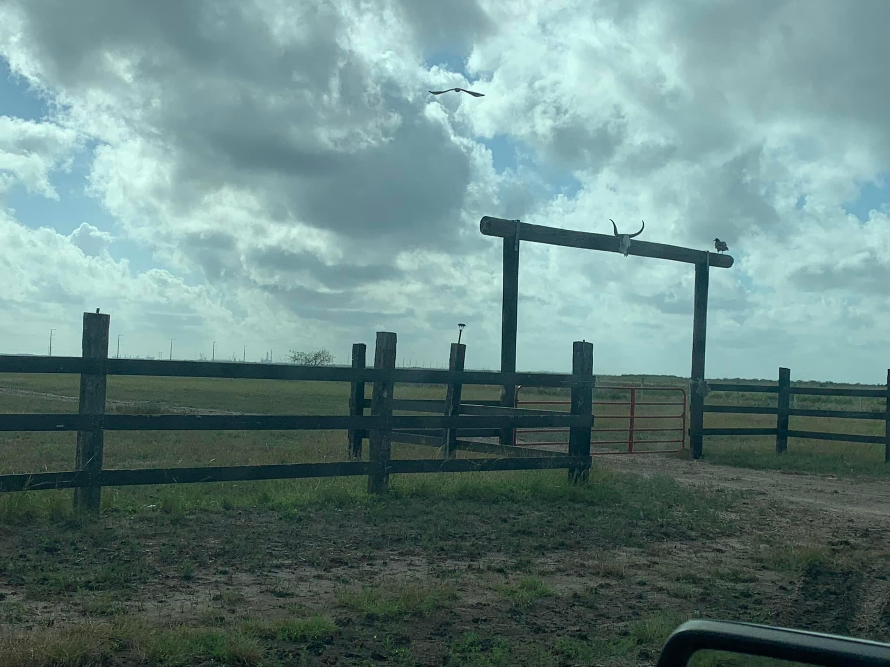
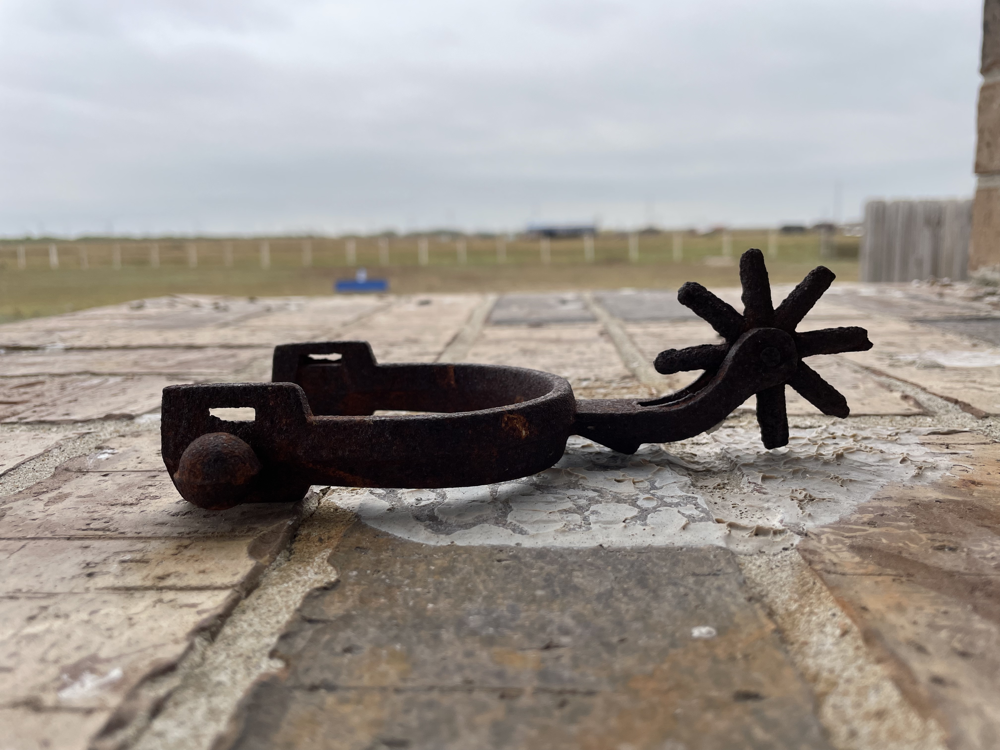
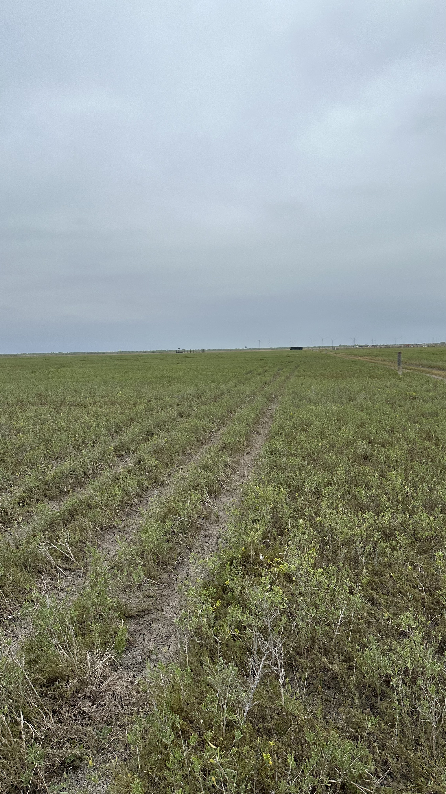
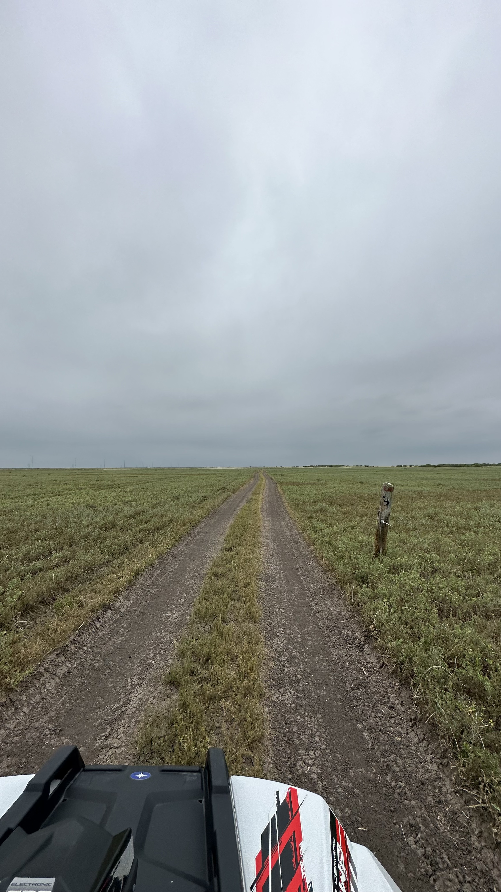
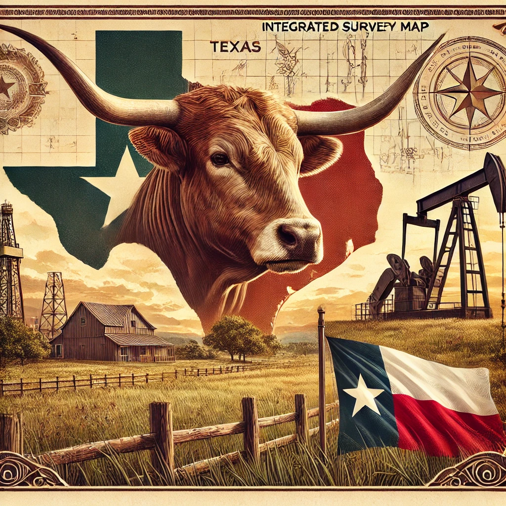
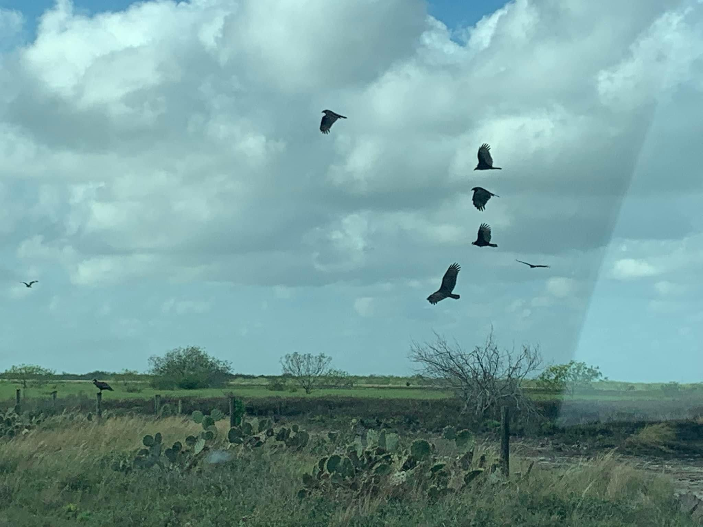

<!DOCTYPE html>
  <html lang="es">
  <head>
    <meta charset="UTF-8">
    <meta name="viewport" content="width=device-width, initial-scale=1.0">
    <title>Lotes De 5 Acres En Venta | Las Tierras Land Investments</title>
    <meta name="description" content="Lotes de 5 acres en venta. Espacio para
  descanso, aventura y convivencia familiar. Contáctanos para más
  información.">
    
  </head>
  <body>
    <header class="container">
      

        <h1>Lotes De 5 Acres En Venta</h1>
        
Tu espacio para descansar, convivir en familia y construir algo
  propio. Terrenos con libertad, privacidad y potencial.

        

          <a class="btn btn-primary" href="tel:+10000000000">Llamar Ahora</a>
          <a class="btn btn-secondary" href="#contacto">Pedir Informacion</a>
        

      

    </header>

    <main class="container">
      <section>
        <h2>Informacion Del Terreno</h2>
        
Conoce una oportunidad para tener 5 acres donde puedas disfrutar
  del campo, montar a caballo, acampar o construir tu lugar de descanso.

        

          
<strong>Tamano:</strong> 5 acres

          
<strong>Uso:</strong> Descanso, inversion,
  recreacion

          
<strong>Acceso:</strong> Agregar detalle aqui</
  div>
          
<strong>Contacto:</strong> Agregar telefono o
  WhatsApp

        

      </section>

      <section>
        <h2>Galeria</h2>
        

          
          
          
          
          
          
        

      </section>

      <section>
        <h2>Lo Que Puedes Disfrutar</h2>
        
Espacio para fogatas, reuniones familiares, caballos, campamentos y
  fines de semana lejos del ruido. No solo compras tierra: compras libertad y
  recuerdos.

      </section>

      <section>
        <h2>Video Del Terreno</h2>
        
Descubre mejor el ambiente y el potencial de estos lotes.

        

          <iframe
            src="https://drive.google.com/file/
  d/1RCnAt18aZtZuJiooEHwaxEjazsiTjS_v/preview"
            allow="autoplay"
            title="Video del terreno"
            allowfullscreen>
          </iframe>
      <section id="contacto" class="contact">
        <h2>Solicita Mas Informacion</h2>
        
Pregunta por disponibilidad, precios y opciones de compra.

        

          <a class="btn btn-primary" href="tel:+10000000000">Llamar</a>
          <a class="btn btn-primary" href="https://
  wa.me/10000000000">WhatsApp</a>
        

      </section>
    </main>

    <footer class="container">
      
Las Tierras Land Investments

    </footer>
  </body>
  </html>

  If you want the page to sell better, add these exact things next:

  - Your phone number or WhatsApp
  - The city/state
  - Price or monthly payments
  - A map or nearby landmarks
  - A short trust section: Escritura, Financiamiento, Acceso, Listo para
    visitar
  - A stronger final CTA: Agenda una visita hoy

  If you want, I can take your exact HTML and rewrite it into a much better-
  looking GitHub Pages landing page in Spanish, keeping your photos and video.

› dont add this :Your phone number or WhatsApp
    - The city/state
    - Price or monthly payments
    - A map or nearby landmarks          but do make it better looking

• Yes. If you do not want contact info, location, price, or a map, then the
  best way to improve it is with stronger visual design, cleaner layout,
  better typography, and a more polished gallery flow.

  This version keeps it simple and makes it look much better without adding
  those details:

  <!DOCTYPE html>
  <html lang="es">
  <head>
    <meta charset="UTF-8">
    <meta name="viewport" content="width=device-width, initial-scale=1.0">
    <title>Lotes En Venta De 5 Acres</title>
        --bg: #efe7d6;
        --bg-soft: #f7f2e8;
        --surface: rgba(255, 250, 241, 0.9);
        --text: #2f241b;
        --muted: #6d5a4b;
        --accent: #b86a2f;
        --accent-dark: #8e4f20;
        --olive: #5b6b3c;
        --border: rgba(105, 79, 52, 0.14);
        --shadow: 0 18px 50px rgba(53, 36, 19, 0.12);
        --radius: 22px;
      }

      * {
        margin: 0;
        padding: 0;
        box-sizing: border-box;
      }

      body {
        font-family: Georgia, "Times New Roman", serif;
        color: var(--text);
        background:
          radial-gradient(circle at top, rgba(255,255,255,0.55), transparent
  35%),
          linear-gradient(180deg, #e7dcc8 0%, #f4ecdf 45%, #eee3d1 100%);
        line-height: 1.65;
      }

      img {
        display: block;
        width: 100%;
        height: 100%;
        object-fit: cover;
      }

      .container {
        width: min(1120px, 92%);
        margin: 0 auto;
      }

      header {
        padding: 28px 0 20px;
      }

      .hero {
        min-height: 78vh;
        border-radius: 30px;
        overflow: hidden;
        position: relative;
        display: grid;
        align-items: end;
        background:
          linear-gradient(to top, rgba(25, 18, 12, 0.72), rgba(25, 18, 12, 0.16)),
          url("land_image_1.jpeg") center center / cover no-repeat;
        box-shadow: var(--shadow);
        isolation: isolate;
      }

      .hero::after {
        content: "";
        position: absolute;
        inset: 0;
        background:
          linear-gradient(135deg, rgba(184,106,47,0.18), transparent 40%),
          linear-gradient(0deg, rgba(91,107,60,0.12), transparent 45%);
        z-index: -1;
      }

      .hero-content {
        padding: clamp(2rem, 5vw, 4.5rem);
        max-width: 760px;
        color: #fffaf2;
      }

      .eyebrow {
        display: inline-block;
        margin-bottom: 1rem;
        padding: 0.45rem 0.8rem;
        border-radius: 999px;
        background: rgba(255,255,255,0.14);
        border: 1px solid rgba(255,255,255,0.22);
        font-size: 0.85rem;
        letter-spacing: 0.08em;
        text-transform: uppercase;
      }

      h1 {
        font-size: clamp(2.8rem, 7vw, 5.5rem);
        line-height: 0.95;
        margin-bottom: 1.2rem;
        font-weight: 700;
      }

      .hero p {
        max-width: 60ch;
        font-size: clamp(1.05rem, 2vw, 1.22rem);
        color: rgba(255, 248, 239, 0.92);
      }

      main {
        padding: 30px 0 70px;
      }

      .section {
        background: var(--surface);
        backdrop-filter: blur(8px);
        border: 1px solid var(--border);
        border-radius: var(--radius);
        padding: clamp(1.4rem, 3vw, 2.2rem);
        box-shadow: var(--shadow);
        margin-bottom: 26px;
      }

      .section-header {
        max-width: 720px;
        margin-bottom: 1.5rem;
      }

      h2 {
        font-size: clamp(1.8rem, 3vw, 2.6rem);
        line-height: 1.05;
        color: var(--olive);
        margin-bottom: 0.7rem;
      }

      .section p {
        font-size: 1.06rem;
        color: var(--muted);
      }

      .split {
        display: grid;
        grid-template-columns: 1.15fr 0.85fr;
        gap: 1.2rem;
        align-items: stretch;
      }

      .feature-card {
        border-radius: 20px;
        overflow: hidden;
        min-height: 360px;
        background: #ddd;
        box-shadow: 0 10px 30px rgba(0,0,0,0.08);
      }

      .feature-text {
        display: flex;
        flex-direction: column;
        justify-content: center;
        padding: 1.5rem;
        border-radius: 20px;
        background: linear-gradient(180deg, #fffaf1, #f4ebdc);
        border: 1px solid rgba(105, 79, 52, 0.1);
      }

      .feature-text strong {
        color: var(--accent-dark);
        font-size: 1.1rem;
        margin-bottom: 0.8rem;
      }

      .gallery {
        display: grid;
        grid-template-columns: repeat(12, 1fr);
        gap: 14px;
        margin-top: 1.2rem;
      }

      .tile {
        overflow: hidden;
        border-radius: 18px;
        min-height: 220px;
        box-shadow: 0 10px 28px rgba(0,0,0,0.08);
        position: relative;
        background: #d9cfbf;
      }

      .tile img {
        transition: transform 0.45s ease, filter 0.45s ease;
      }

      .tile:hover img {
        transform: scale(1.06);
        filter: saturate(1.06) contrast(1.03);
      }

      .tile.large {
        grid-column: span 7;
        min-height: 340px;
      }

      .tile.medium {
        grid-column: span 5;
        min-height: 340px;
      }

      .tile.small {
        grid-column: span 4;
      }

      .video-frame {
        margin-top: 1.2rem;
        border-radius: 20px;
        overflow: hidden;
        aspect-ratio: 16 / 9;
        box-shadow: 0 14px 36px rgba(0,0,0,0.12);
      }

      .video-frame iframe {
        width: 100%;
        height: 100%;
        border: 0;
      }

      .closing {
        text-align: center;
        padding: 2.2rem 1.5rem;
        background:
          linear-gradient(135deg, rgba(184,106,47,0.12), rgba(91,107,60,0.08)),
          #fff8ee;
      }

      .closing h2 {
        color: var(--accent-dark);
      }

      footer {
        text-align: center;
        padding: 0 0 50px;
        color: #7a6758;
        font-size: 0.95rem;
      }

      @media (max-width: 900px) {
        .split {
          grid-template-columns: 1fr;
        }

        .tile.large,
        .tile.medium,
        .tile.small {
          grid-column: span 12;
          min-height: 260px;
        }

        .hero {
          min-height: 68vh;
        }
      }

      @media (max-width: 640px) {
        .container {
          width: min(94%, 1120px);
        }

        .hero-content {
          padding: 1.4rem;
        }

        .section {
          padding: 1.2rem;
        }

        h1 {
          font-size: 2.5rem;
        }

        h2 {
          font-size: 1.65rem;
        }

        .tile.large,
        .tile.medium,
        .tile.small {
          min-height: 220px;
        }
      }
    </style>
  </head>
  <body>
    <header class="container">
      <section class="hero">
        

          Espacio, Naturaleza, Libertad
          <h1>Lotes En Venta De 5 Acres</h1>
          

            Un lugar para desconectarte, disfrutar con tu familia y construir recuerdos
            alrededor del campo, el cielo abierto y la tranquilidad.
          

        

      </section>
    </header>

    <main class="container">
      <section class="section">
        

          <h2>Libertad Y Aventura</h2>
          

            Imagina tu propio espacio para montar a caballo, construir una cabaña,
            disfrutar una fogata y vivir fines de semana rodeado de naturaleza.
          

        

        

          

            
          

          

            <strong>Un lugar para crear momentos</strong>
            

              Aquí no solo hay terreno. Hay espacio para respirar, reunirte con los tuyos
              y disfrutar experiencias sencillas que se vuelven inolvidables.
            

          

        

      </section>

      <section class="section">
        

          <h2>Galería Del Terreno</h2>
          

            Una colección más cuidada de imágenes hace que la página se sienta más premium
            y menos como una lista improvisada de fotos.
          

        

        

          

            
          

          

            
          

          

            
          

          

            
          

          

            
          

          

            
          

          

            
          

          

            
          

        

      </section>

      <section class="section">
        

          <h2>Experiencias Que Inspiran</h2>
          

            Explora, acampa, disfruta del amanecer y convierte cada visita en una escapada
            diferente dentro de tu propio espacio.
          

        

        

          

            
          

          

            
          

        

      </section>

      <section class="section">
        

          <h2>Lo Que Les Espera</h2>
          

            Descubre mejor la energía y la amplitud de estos 5 acres en video.
          

        

        

          <iframe
            src="https://drive.google.com/file/d/1RCnAt18aZtZuJiooEHwaxEjazsiTjS_v/preview"
            allow="autoplay"
            title="Video del terreno"
            allowfullscreen>
          </iframe>
        

      </section>

      <section class="section closing">
        

          <h2>Las Tierras Land Investments</h2>
          

            Naturaleza, amplitud y una forma distinta de imaginar tu propio lugar.
          

        

        

          

            
          

          

            
          

          

            
          

        

      </section>
    </main>

    <footer class="container">
      Las Tierras Land Investments
    </footer>
  </body>
  </html>
